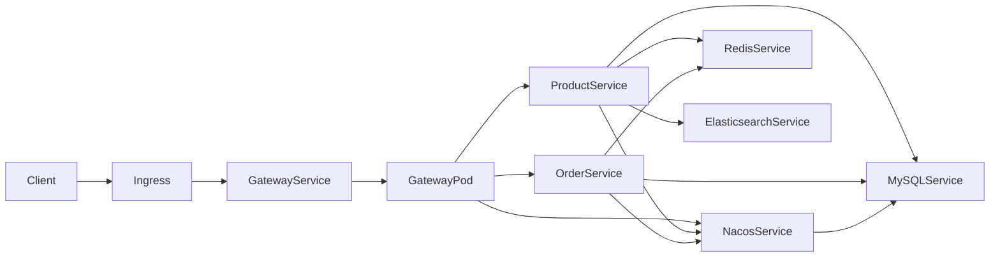

# Java Review K8s 学习手册

这份文档用于快速理解 `k8s/` 目录中每个文件的作用，以及推荐的学习顺序。

## 1. 学习顺序（建议按这个走）

1. 先看 `base/namespace.yaml`：理解“资源隔离”。
2. 再看 `base/configmap.yaml` + `base/secret.yaml`：理解“配置与密钥注入”。
3. 看中间件：
   - `base/mysql.yaml`
   - `base/redis.yaml`
   - `base/elasticsearch.yaml`
   - `base/nacos.yaml`
4. 看业务服务：
   - `base/product.yaml`
   - `base/order.yaml`
   - `base/gateway.yaml`
5. 看流量与弹性：
   - `base/ingress.yaml`
   - `base/hpa.yaml`
   - `base/pdb.yaml`
6. 最后看组织方式：
   - `base/kustomization.yaml`
   - `overlays/local/kustomization.yaml`

## 2. 目录与文件地图

```text
k8s/
├── base/
│   ├── namespace.yaml        # 命名空间
│   ├── configmap.yaml        # 非敏感环境变量
│   ├── secret.yaml           # 敏感变量（示例：MySQL 密码）
│   ├── mysql.yaml            # MySQL(ConfigMap+Service+StatefulSet+PVC)
│   ├── redis.yaml            # Redis(Service+StatefulSet+PVC)
│   ├── elasticsearch.yaml    # ES(Service+StatefulSet+PVC)
│   ├── nacos.yaml            # Nacos(Service+Deployment)
│   ├── product.yaml          # 商品服务(Service+Deployment)
│   ├── order.yaml            # 订单服务(Service+Deployment)
│   ├── gateway.yaml          # 网关服务(Service+Deployment)
│   ├── ingress.yaml          # 对外入口(Ingress)
│   ├── hpa.yaml              # 自动扩缩容(HPA)
│   ├── pdb.yaml              # 中断预算(PDB)
│   └── kustomization.yaml    # base 资源清单入口
└── overlays/
    └── local/
        └── kustomization.yaml # 本地学习环境入口
```

## 3. 一图看懂依赖关系



## 4. 最小可运行步骤

### 4.1 构建镜像

在项目根目录执行：

```bash
mvn clean package -DskipTests
docker build -t java-review-product:latest ./java-review-product
docker build -t java-review-order:latest ./java-review-order
docker build -t java-review-gateway:latest ./java-review-gateway
```

如果使用 kind：

```bash
kind load docker-image java-review-product:latest
kind load docker-image java-review-order:latest
kind load docker-image java-review-gateway:latest
```

### 4.2 部署

```bash
kubectl apply -k k8s/overlays/local
```

### 4.3 验证

```bash
kubectl get pods -n java-review
kubectl get svc -n java-review
kubectl get ingress -n java-review
kubectl get pvc -n java-review
```

## 5. 常用学习命令

### 5.1 查看日志与状态

```bash
kubectl logs -n java-review deployment/java-review-gateway
kubectl describe pod -n java-review <pod-name>
kubectl get events -n java-review --sort-by=.metadata.creationTimestamp
```

### 5.2 调试联通性

```bash
kubectl port-forward -n java-review svc/java-review-gateway 8080:8080
curl http://localhost:8080/api/product/1
curl http://localhost:8080/api/order/list
```

```bash
kubectl port-forward -n java-review svc/nacos 8848:8848
# 浏览器访问 http://localhost:8848/nacos/
```

### 5.3 滚动发布与回滚

```bash
kubectl set image deployment/java-review-product \
  java-review-product=java-review-product:latest \
  -n java-review
kubectl rollout status deployment/java-review-product -n java-review
kubectl rollout undo deployment/java-review-product -n java-review
```

### 5.4 HPA/PDB 查看

```bash
kubectl get hpa -n java-review
kubectl describe hpa java-review-gateway -n java-review
kubectl get pdb -n java-review
```

## 6. 常见问题速查

- `Pod` 一直 `Pending`：
  - 通常是资源不足或 PVC 无法绑定，先看 `kubectl describe pod` 和 `kubectl get pvc`。
- `ImagePullBackOff`：
  - 本地镜像未导入到集群节点（尤其是 kind/minikube）。
- 网关可用但路由失败：
  - 先检查 Nacos 中是否注册了 `java-review-product` / `java-review-order`。
- HPA 不生效：
  - 检查是否安装 `metrics-server`，并确认 `kubectl top pods -n java-review` 有数据。

## 7. 清理环境

```bash
kubectl delete -k k8s/overlays/local
```
